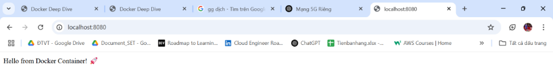

# 🚀 Build và Chạy Ứng Dụng Node.js Cơ Bản với Docker

Để build một image cho dự án Node.js cơ bản và chạy container, thực hiện các bước sau:

## 🛠️ Các bước thực hiện:

### 📦 Bước 1: Tạo Dockerfile

Tạo một file tên `Dockerfile` trong thư mục gốc của dự án Node.js

### 🏗️ Bước 2: Build image

```bash
docker build -t my-node-app .
```

### 🧱 Bước 3: Chạy container

```bash
docker run -d -p 8080:5000 --name web-container my-node-app
```

### 🌐 Bước 4: Truy cập trình duyệt

```bash
http://localhost:8080
```

## Kết quả 

