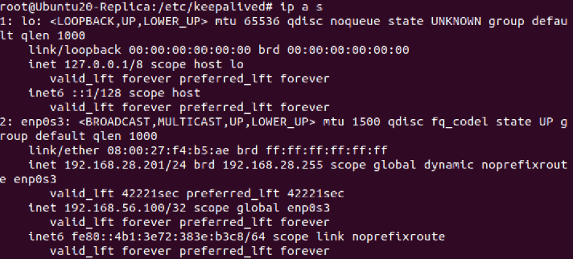
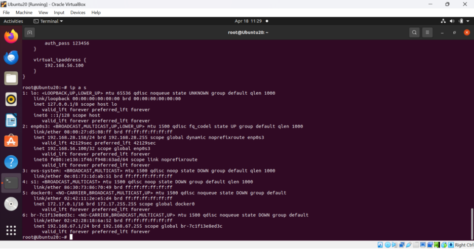
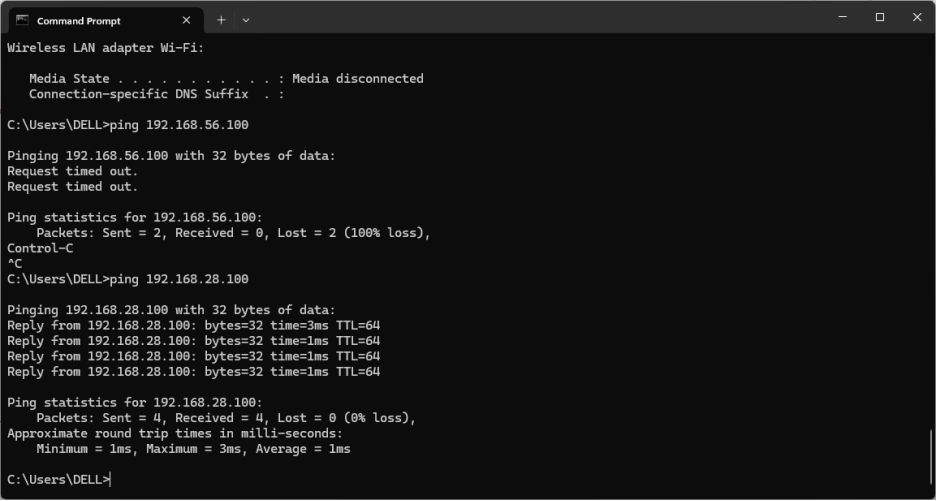

# 🛡️ Cài đặt Keepalived cho High Availability (HA)

## 🎯 Mục tiêu

Thiết lập một hệ thống **High Availability (HA)** sử dụng **Keepalived** để cung cấp một **địa chỉ IP ảo (VIP - Virtual IP)** có khả năng **chuyển đổi tự động giữa hai máy chủ (Master/Backup)** khi xảy ra sự cố.

---

## ⚙️ Cài đặt Keepalived

Thực hiện trên **cả hai máy chủ** (Master & Backup):

```bash
sudo apt update
sudo apt install keepalived -y
```

---

## 🧩 Cấu hình Virtual IP (VIP)

Chỉnh sửa file cấu hình:  
```bash
sudo nano /etc/keepalived/keepalived.conf
```

### 🔹 Trên máy chủ A (Master)

```bash
vrrp_instance VI_1 {
    state MASTER
    interface eth0                  # Thay bằng tên interface mạng của bạn
    virtual_router_id 51
    priority 100
    advert_int 1
    authentication {
        auth_type PASS
        auth_pass 1234
    }
    virtual_ipaddress {
        192.168.56.100              # VIP - IP ảo cùng subnet với 2 máy
    }
}
```

### 🔸 Trên máy chủ B (Backup)

```bash
vrrp_instance VI_1 {
    state BACKUP
    interface eth0
    virtual_router_id 51
    priority 90
    advert_int 1
    authentication {
        auth_type PASS
        auth_pass 1234
    }
    virtual_ipaddress {
        192.168.56.100
    }
}
```

---

## 🚀 Khởi động và kiểm tra

Trên cả 2 máy chủ:

```bash
sudo systemctl enable keepalived
sudo systemctl start keepalived
sudo systemctl status keepalived
```

Trên máy Master, dùng lệnh sau để kiểm tra IP ảo:

```bash
ip a s
```



Bạn sẽ thấy địa chỉ **192.168.56.100** được gán vào interface mạng.

---

## 🔄 Mô phỏng tình huống chuyển đổi (Failover)

### 💥 Tắt Keepalived trên Master

```bash
sudo systemctl stop keepalived
```

- Sau vài giây, địa chỉ IP ảo (`192.168.56.100`) sẽ **chuyển sang máy Backup**.
- Kiểm tra bằng cách chạy `ip a s` trên máy Backup.



---

## ✅ Kết quả

- **VIP hoạt động ổn định**, ping được từ bên ngoài:
```bash
ping 192.168.56.100
```

- IP ảo nằm **cùng subnet với máy host và 2 máy ảo**, đảm bảo truy cập được trong môi trường mạng nội bộ.



---

## 📌 Kết luận

- Trong ứng dụng thực tế, **Keepalived** được sử dụng để triển khai **High Availability (HA)**.
- Điều này giúp đảm bảo rằng một địa chỉ IP quan trọng luôn hoạt động, ngay cả khi một trong các máy chủ gặp sự cố.
- ✅ Giải pháp HA này giúp tăng độ tin cậy, giảm downtime và bảo vệ dịch vụ mạng.

---

## 🧪 Môi trường thực hành

```
.
├── 2 máy ảo Debian/Ubuntu (VMware/VirtualBox)
├── IP host:         192.168.56.1
├── IP máy Master:   192.168.56.10
├── IP máy Backup:   192.168.56.11
└── IP ảo (VIP):      192.168.56.100
```
```
