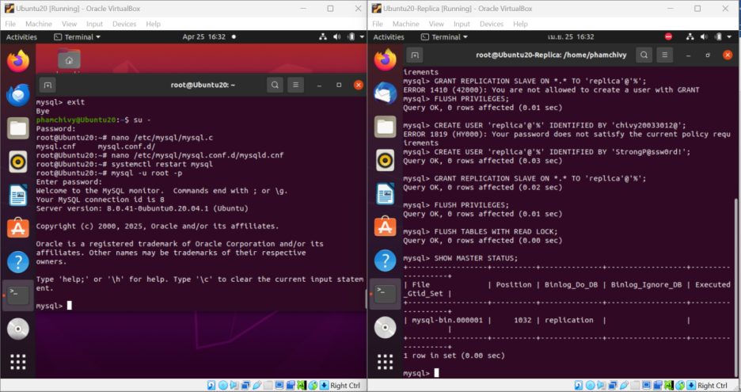
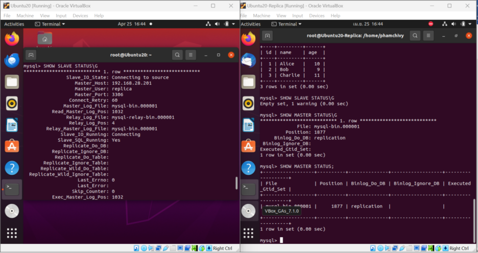

# 🛠️ Cài đặt MySQL Replication Master - Slave

## 🎯 Mục tiêu

Thiết lập hệ thống **replication MySQL** giữa hai máy:  
- **Máy Master**: Ghi dữ liệu chính  
- **Máy Slave**: Tự động đồng bộ dữ liệu từ Master để **tăng tính sẵn sàng và backup**

---

## 🧩 A. Cấu hình trên máy **Master**

### 🔹 Bước 1: Chỉnh sửa file cấu hình MySQL

```bash
sudo nano /etc/mysql/mysql.conf.d/mysqld.cnf
```

**Thêm hoặc sửa các dòng sau**:

```ini
bind-address = 0.0.0.0
server-id = 1
log_bin = /var/log/mysql/mysql-bin.log
binlog_do_db = ten_database_can_dong_bo    # Thay bằng tên DB bạn muốn replicate
```

👉 **Khởi động lại MySQL**:

```bash
sudo systemctl restart mysql
```

---

### 🔹 Bước 2: Tạo user để đồng bộ

Đăng nhập vào MySQL:

```bash
mysql -u root -p
```

Thực hiện các lệnh sau:

```sql
CREATE USER 'replica'@'%' IDENTIFIED BY 'mat_khau_manh';
GRANT REPLICATION SLAVE ON *.* TO 'replica'@'%';
FLUSH PRIVILEGES;
```

👉 **Khóa ghi toàn bộ bảng và lấy trạng thái replication:**

```sql
FLUSH TABLES WITH READ LOCK;
SHOW MASTER STATUS;
```

Bạn sẽ thấy kết quả:

```
+------------------+----------+--------------+------------------+-------------------+
| File             | Position | Binlog_Do_DB | Binlog_Ignore_DB | Executed_Gtid_Set |
+------------------+----------+--------------+------------------+-------------------+
| mysql-bin.000001 |      107 | your_db_name |                  |                   |
+------------------+----------+--------------+------------------+-------------------+
```

📌 **Lưu lại `File` và `Position` — sẽ dùng cho cấu hình Slave.**

---

## 🧩 B. Cấu hình trên máy **Slave**

### 🔸 Bước 1: Chỉnh sửa file cấu hình

```bash
sudo nano /etc/mysql/mysql.conf.d/mysqld.cnf
```

**Thêm/sửa các dòng sau**:

```ini
server-id = 2
relay-log = /var/log/mysql/mysql-relay-bin.log
```

👉 **Khởi động lại MySQL**:

```bash
sudo systemctl restart mysql
```

---

### 🔸 Bước 2: Kết nối và cấu hình Slave

Đăng nhập vào MySQL:

```bash
mysql -u root -p
```

Chạy các lệnh sau:

```sql
STOP SLAVE;

CHANGE MASTER TO
  MASTER_HOST='192.168.1.100',         -- IP máy Master
  MASTER_USER='replica',
  MASTER_PASSWORD='mat_khau_manh',
  MASTER_LOG_FILE='mysql-bin.000001',  -- Lấy từ SHOW MASTER STATUS
  MASTER_LOG_POS=107;                  -- Lấy từ SHOW MASTER STATUS

START SLAVE;
```

---

## 🧪 Kiểm tra trạng thái replication

Trên máy **Slave**, chạy:

```sql
SHOW SLAVE STATUS\G
```

Kết quả mong muốn:

```text
Slave_IO_Running: Yes
Slave_SQL_Running: Yes
```

👉 Nếu cả hai là `Yes` → replication đang hoạt động bình thường.

---

## 🔓 Mở khóa ghi trên máy Master

Quay lại cửa sổ terminal đã chạy lệnh LOCK, gõ:

```sql
UNLOCK TABLES;
```

---

## ✅ Kết quả mong đợi

- Máy Slave tự động nhận dữ liệu mới từ Master.
- Quá trình ghi dữ liệu trên Master sẽ được **replicate gần như ngay lập tức** sang Slave.
- **Tăng khả năng dự phòng và backup** cho hệ thống cơ sở dữ liệu.

---

## 📌 Tóm tắt hệ thống

```
.
├── Master:       192.168.1.100
│   └── server-id = 1
│   └── binlog: mysql-bin.000001
├── Slave:        192.168.1.101
│   └── server-id = 2
│   └── relay-log: mysql-relay-bin.log
└── Replication User: 'replica'@'%'
```




---
