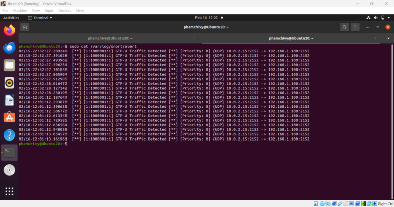

# 🧪 Test Snort Đơn Giản với GTP-U và Scapy (Mô phỏng lưu lượng 5G)

## 📶 Mô phỏng lưu lượng 5G bằng Scapy

Sử dụng **Scapy** để tạo gói tin **GTP-U (GPRS Tunneling Protocol - User Plane)** nhằm mô phỏng traffic của mạng 5G. GTP-U thường sử dụng **UDP port 2152** để truyền dữ liệu giữa các node trong core network (ví dụ: giữa gNodeB và UPF).

---

## ⚙️ Sử dụng Snort để phát hiện GTP-U

### Bước 1: Tạo file rule mới

- Tạo file rule mới, ví dụ: `gtp.rules`
- Thêm rule đơn giản để phát hiện lưu lượng đi qua cổng UDP 2152:
- Kiểm tra rule hợp lệ:
```
snort -T -c /etc/snort/snort.conf -R /path/to/local.rules
```
- Lưu ý: Cần chắc chắn snort.conf có dòng include /path/to/local.rules

### Bước 2: Ghi log và cảnh báo IDS

Snort mặc định log ra thư mục /var/log/snort/

### Bước 3: Chạy Snort giám sát mạng

Chạy Snort ở chế độ IDS trên một interface
```
sudo snort -i eth0 -A console -c /etc/snort/snort.conf -R /path/to/gtp.rules
```

## ✅ Kết quả




